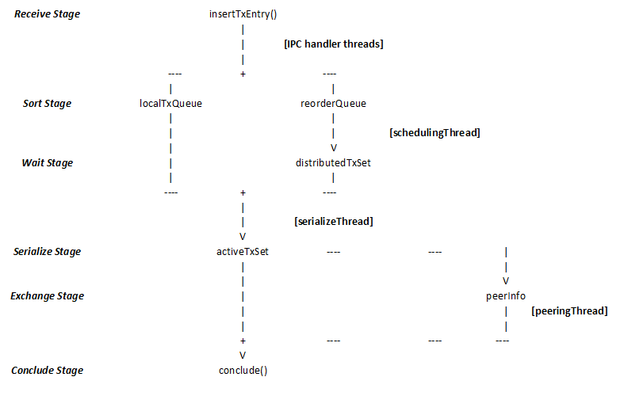

# Software Architecture

QuantaDB (QDB) leverages the RAMCloud (RC) framework because we like its IPC
infrastructure, which supports RDMA and TCP options. Also, we would like to use
RAMCloud as a benchmark for performance comparison.

QuantaDB is delivered as a package of RAMCloud and additional components. The
majority of DSSN-specific components can be found under the `src/quantadb/` directory.

The package can be compiled to generate executables of RC itself or QuantaDB, by
controlling the compile flags.

Figure 6 shows a simplified organization of the C++ classes. On the client side,
the RC's ClientTransactionTask class is modified to use QDB's Sequencer class.
On the server side, QDB's DSSNService class adapts the RC's transaction handling
into QDB's transaction handling. The DSSNService class instantiates Validator
class and HashmapKVStore class. The Validator class uses HashmapKVStore class
and other QDB classes.

**Figure 6. QuantaDB software organization.**

## ramcloud

RAMCloud provides a distributed transactional in-memory KV store. RAMCloud
project documentation can be accessed on the internet, starting from here:
<https://github.com/PlatformLab/RAMCloud>.

RAMCloud's RPC infrastructure is relevant to QuantaDB. A single dispatch thread
polls across all configured transports. RPC request is dispatched to a pool of
IPC handler threads.

**Figure 7. RAMCloud RPC infrastructure.**

## coordinator

QDB's coordinator (different from RC's coordinator) is meant to be a library
to be used by a transaction client. The qdb/Coordinator has not been
implemented as a separate class yet although its expected functional
behaviors are described in the header file.

Instead, QDB's coordinator functionalities are implemented by adapting the
RC's ClientTransactionTask. QDB-specific codes are encapsulated within the
\#ifdef blocks. The decision is for reducing the development effort to
integrate QDB components into RC legacy code.

We expect QDB's Coordinator class will be implemented as there are desirable
performance optimizations that can be done there.

## sequencer

The QDB Sequencer is implemented as a library, as opposed to being a
separate server machine or a server thread. In other words, a client
transaction thread calls the Sequencer API to get a globally unique commit
timestamp (CTS). The Sequencer constructs a 128-bit CTS.

The upper 64 bits represent a clock value in the units of nanoseconds. The
sequencer gets a clock value from the server's clock infrastructure through
gdb/ClusterTimeService class. The clocks of the machines are supposed to be
synchronized to a sub-micro-second precision, presumably using NIC-based
PTP. The precision of clock synchronization is crucial to produce a
high-performance storage cluster.

The upper 64 bits are set to the current clock value plus a delta. The delta
currently is hard-coded. It represents the expected network latency from the
client machine to the server machine.

The lower 64 bits contain a sequencer identifier to make the whole 128-bit
CTS globally unique so that each transaction can be uniquely identified in
the storage cluster. The lower 64 bits can be interpreted as a fraction of a
nanosecond.

## validator

The Validator is instantiated in the main thread context. There is only one
instance per shard. Currently, one machine supports one shard. Therefore,
there is only one HashmapKVStore instance per machine, as it represents one
KV store shard.

Validator implements a processing pipeline of transaction validation logics
in order to maximize the cluster's transaction throughput. It spawns threads
so that they take care of the processing in the pipeline stages.

**Figure 8. Validator stages of processing.**

The DSSNService provides multiple-threaded IPC handlers. They call
insertTxEntry() when they receive any commit request. The function divides
the commit requests into local-shard commit intents (CIs) and cross-shard
ones. The former are queued up in localTxQueue, the latter in reorderQueue.
The reorderQueue is implemented using a skip list so that the CIs are sorted
by CTS.

The schedulingThread moves the CIs which have reached beyond the current
system time into the distributedTxSet, which tracks the dependencies of the
waiting CIs.

The serializeThread manages a serialization window during which only
independent CIs are subject to SSN validation checks.

For cross-shard transactions, a peeringThread handles the SSN info exchanges
so that their CIs can reach conclusions consistent with their peers'.

*ActiveTxSet*

Validation of cross-shard transactions involve message exchanges about the
transaction metadata among the shards. During the validation, no other
coming transactions should affect the read set and write set data and
metadata of the transactions going through the validation. We call the
period of serialization the serialization window. Only independent
transactions are allowed into the serialization window. Any coming
transaction that has dependency on any of the transactions in the
serialization window must wait and be queued up.

The serialization window can be safeguarded using mutexes. The
finest-grained mutex would be one for each database entry, but that would
imply a lot of memory for mutexes.

Bloom filter (BF) is a space-efficient, probabilistic data structure that is
used to test whether an element is a member of a set. False positives are
possible, but false negatives are not. Elements can be added to the set but
not removed from it. A counting BF (CBF) allows elements to be removed from
the set.

We use CBF to implement the serialization window. A coming transaction is
tested against the CBF that represents the set of transactions in the
serialization window. We call that CBF the active transaction set CBF. The
activeTxSet contains one.

In our implementation, a CBF is an array of integers. Each array element
corresponds to one slot, indexed by a hash value of the tuple key. The
integer represents the counter value. For each tuple key, we derive two hash
values using two hash functions. It is a CBF hit if the tuple key's two
corresponding counter values are both non-zero; otherwise, it is a CBF miss.
A tuple is probably a member of the set in the case of a CBF hit. Otherwise,
the tuple is for sure not a member of the set.

A transaction has a read set and a write set. The read set has zero or more
tuples. The write set has zero or more tuples. At least one of the read and
write sets should contain a tuple.

We define an active transaction set, i.e., activeTxSet, as a set containing
all independent transactions that are undergoing cross-shard validation
message exchanges. It has an associated CBF.

A transaction is a member of the active transaction set if any tuple in its
read set and write set hits the CBF. Otherwise, the transaction is not a
member of the active transaction set.

The goal is to maximum processing concurrency, so it is desirable to add as
many transactions to the active transaction set as possible. Because they
are supposed to be independent, we need to check whether a current
transaction hits the CBF before adding the current transaction to the active
transaction set.

Given a current transaction, go through each of the tuples in the read set
and write set. Check if the tuple hits the CBF. If one tuple does, then the
current transaction is considered to be dependent on a transaction already
in the active transaction set. It cannot be added to the active transaction
set until some transactions in the set are removed from the set for a
re-test. Otherwise, the current transaction is deemed to be independent and
can be added to the active transaction set.

The transactions in the set will go through validation message exchanges and
come to commit or abort conclusions. They do so concurrently and
simultaneously. Because there are independent of each other, their timing of
conclusions does not affect the serializability of the conclusions.

Any concluded transaction is to be removed from the active transaction set.
Go through each tuple of its read set and write set. Decrement the two
corresponding counters of each tuple key. Consequently, a new transaction
that depends on the concluded transaction can later find no hit on the CBF
and be allowed into the active transaction set.

Since each tuple key is a string of bytes of arbitrary length and values, a
hash value is calculated by running through the string of bytes. Testing a
transaction against the active transaction membership is a frequent
operation.

There are three methods to expedite the operation and reducing memory
accesses. The first is to calculate the hash values for each tuple key only
once and store them in an array instead of re-reading the tuple key values
and re-calculating the hash values again and again. Also, when one of the
tuple keys hits the CBF and therefore fails the test, the position of the
tuple key is cached. The next membership test for the same transaction will
start from the cached position. It is because the same tuple key is likely
to fail the test again. In other words, instead of starting from the first
tuple key in the read set or the write set, cache the position of the tuple
key that fails the test and resume from there in the re-test until all tuple
keys have passed the test.

The second method is to add the tuple key to the CBF right after it passes
the CBF test. That takes advantage of the fresh cache lines still holding
the relevant memories. When the CBF test fails, remove the tuple keys in the
new transaction that have been added to the CBF, undoing the effect of
having partially added the transaction to the CBF. Compared to the
alternative of finishing testing all tuple keys first and then adding them
to the CBF, the method is more efficient for two reasons. Firstly, the CPU
cache lines are still holding on the parts being used in the test and add
operations. There would be more cache line hits. Secondly, it is more likely
that a transaction is independent of the active transaction set than not.

The third method is to enable concurrent adding tuple keys to the CBF and
removing tuple keys from the CBF. We use an atomic integer for a counter
taking advantage of the CPU support of such atomic instructions on the
counter. Multi-threaded operations on the atomic integers are naturally
supported by the CPU. Therefore, the operations on the CBF can be
multi-threaded and concurrent.

*DistributedTxSet*

The waiting transactions, those in distributedTxSet, are constantly checked
again to test whether any of them is allowed into the active transaction
set, i.e., activeTxSet. Because different waiting transactions may depend on
different transactions in the active transaction set, we need to test each
waiting transaction to maximize processing concurrency. However, it can be
computationally expensive to scan through them. To make that process
efficient, one solution is to track the dependencies among the waiting
transactions. Suppose there is a chain of dependent transactions. If the
head of the chain is blocked from admission into the active transaction set,
then the rest of the transactions in the chain does not need to be tested.
In other words, we do not need to test all transactions every time after a
concluded transaction has been removed from the active transaction set
because the dependency graph would indicate which specific ones to be
tested. However, the difficulty lies in tracking the full dependencies of
the waiting transactions as the amount of memory and operations increases
exponentially with the number of transactions.

In our implementation, we do not track the full dependencies in order to
keep the memory footprint manageable. We use three queues: independent
queue, cold queue, and hot queue. The independent queue is used to queue up
the transactions that have been tested to be independent of the waiting
transactions ahead of it sequentially. These transactions can be tested
against the active transaction set when there is a removal from it.

The cold queue is used to queue up transactions that have been tested to be
dependent on the waiting transactions already in the independent queue or
cold queue.

The hot queue is used to queue up transactions that have been tested to be
dependent on the waiting transactions already in the independent queue or
cold queue or hot queue.

The cold queue size is made much smaller than the hot queue size. We also
use a hot threshold which is smaller than the cold queue size. When a new
transaction is tested to be dependent on transactions already in the cold
queue and the current number of queued transactions in the cold queue
exceeds the hot threshold, the new transaction is enqueued to the hot queue.
That is a way to differentiate a transaction that has a long chain of
dependency. Transactions in the hot queue are considered to have long chains
of dependency. It is a simplified way to tell without tracking the
dependency graphs.

Each of the independent, cold, and hot queues is backed by a CBF. The CBF
keeps the membership of the transactions enqueued in a specific queue. The
CBF provides a quick way to test dependency. When a transaction is added a
queue, the transaction's tuple keys are added to its CBF. When a transaction
is removed from the queue, they are removed from the queue's CBF.

To select a transaction from the independent queue, the cold queue, and the
hot queue to be tested against the active transaction set and enter into the
active transaction set, we need to consider the CTS of the transaction. It
is because the transactions in the independent, cold and hot queues have
dependencies and have been tested on dependencies sequentially during the
insertion procedure. They must be dequeued sequentially. For example, a
transaction in the hot queue with a lower CTS should be dequeued before a
transaction in the cold queue or the independent queue with a higher CTS.
Similarly, a transaction in the cold queue with a lower CTS should be
dequeued before a transaction in the hot queue or the independent queue with
a higher CTS. On the other hand, a transaction in the independent queue can
selected any time because it has been tested having no dependency on any
transaction with a lower CTS.

*PeerInfo*

PeerInfo tracks the information from the peers of each transaction and
handles the SSN info exchanges with the peers. A transaction can only reach
a conclusion when all peers' info is received. However, there is a
possibility that the peer's info message is received before a transaction's
SSN info is sent out. There is also a possibility that the peer's info
message is lost. Therefore, the PeerInfo could move a transaction into an
alert state, which indicates that the transaction needs special care to come
a conclusion.

## Backing KV store

The validator interacts with the backing KV store through a set of APIs to
assess KV tuples and corresponding metadata. Currently the backing KV store
is implemented as HashmapKVStore in memory. In the future, the backing KV
store can be based on persistent memory. Then, the in-memory KV store will
store KV tuple metadata.

To optimize for system performance, the read request from the client or the
coordinator does not go through Validator. The IPC handlers would retrieve
the data and metadata directly from the KV store. Also, when an IPC handler
receives a commit request, it will assess the KV store to prepare memory for
the write set. Then, it will save some compute time when the transaction is
concluded.

