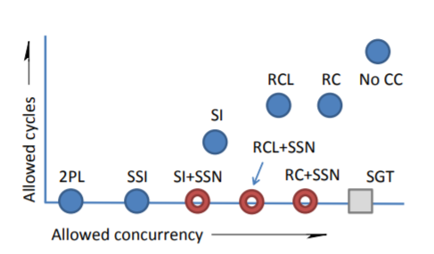

# Distributed Serial Safety Net

QuantaDB uses a concurrency control protocol called DSSN.

## Background

In database systems and transaction processing, concurrency control (CC)
schemes interleave read/write requests from multiple clients simultaneously,
giving the illusion that each transaction has exclusive access to the data.
Distributed concurrency control refers to the concurrency control of a
database distributed over a communication network. Serializability ensures
that a schedule for executing concurrent transactions is equivalent to one
that executes the transactions serially in some order. It is considered to
be the highest level of isolation between concurrent transactions. It
assumes that all accesses to the database are done using read and write
operations. A desirable goal of a distributed database is distributed
serializability, which is the serializability of a schedule of concurrent
transactions over a distributed database.

The most common distributed concurrency control schemes are two-phase
locking (2PL), snapshot isolation (SI), Multi-Version Optimistic Concurrency
Control (MVOCC), and Read Committed (RC). They are also common centralized
concurrency control schemes. Each control scheme allows for more
concurrency, i.e., more schedules of concurrent transactions to be permitted
and hence higher transaction throughput, of a distributed database system.
2PL can achieve a serializable isolation level, but RC and SI cannot. To
make non-serializable concurrency control schemes provide a serializable
isolation level, a serialization certifier can be used. One example is
serializable snapshot isolation (SSI). Wang, et. al., in "Efficiently Making
(Almost) Any Concurrency Control Mechanism Serializable" The VDLB Journal -- 
The International Journal on Very Large Data Bases, Volume, 26, Issue 4,
August 2017, introduced a certifier called the "Serial Safety Net" (SSN), a
serialization certifier that can make otherwise non-serializable RC and SI
concurrency control schemes achieve a serializable isolation level,
meanwhile allowing more concurrency than the SSI scheme. Figure 1
illustrates that SSN would allow higher concurrency than 2PL and SSI.

[Adapted from Wang, et. al.]

**Figure 1. SSN compared to other CC schemes.**

SSN assumes a shared memory where the updates to each versions' timestamps
are instantaneous. This assumption is not valid in a distributed environment
and may lead to poor throughput in a distributed environment. Also, when
transactions are contentious, SSN may abort many transactions, which limits
the effective transaction rate. Thus, while Wang, et. al. present a fully
parallel multi-threading, latch-free, and shared-memory implementation for a
multi-version database management system on a single multi-processor server,
Wang et al. do not address a fully distributed multi-version database
management system.

DSSN is a fully distributed concurrency control scheme that makes SSN
validation to be distributed. It can greatly improve the performance of ACID
transactional database system, which includes multi-core databases,
clustered databases, distributed databases, especially geo-distributed
databases.

