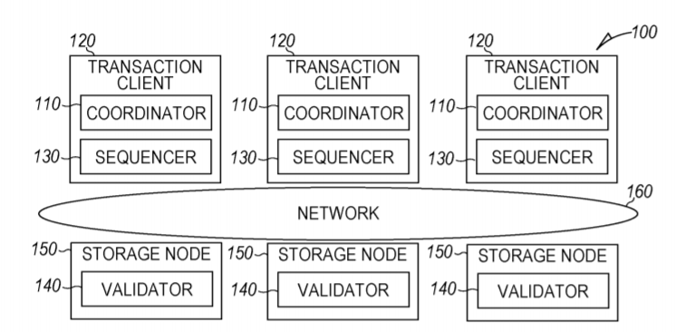
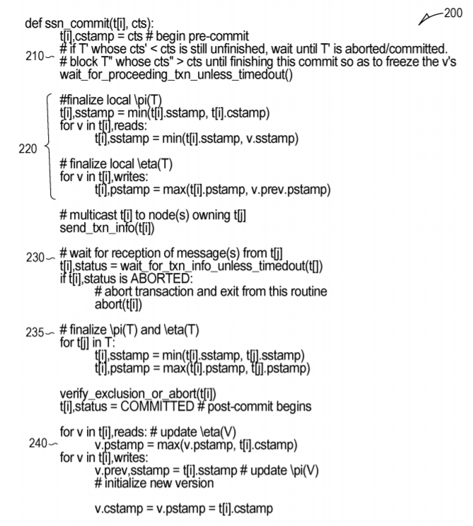
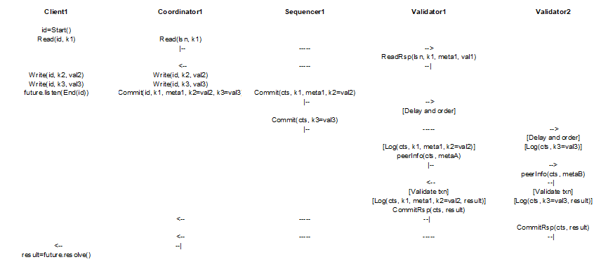
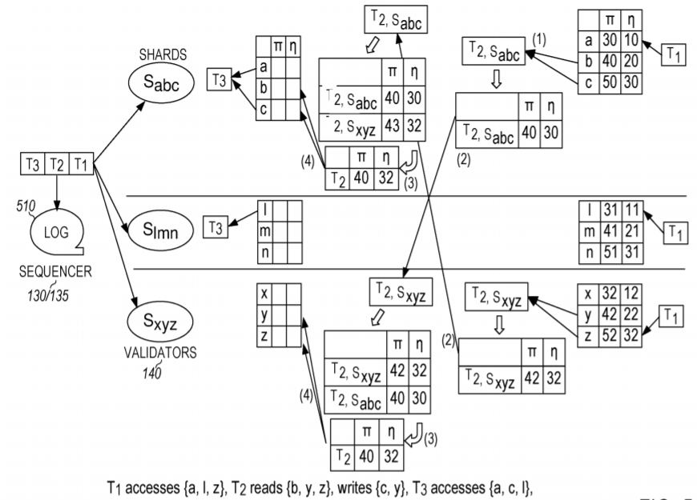

DSSN is a fully distributed concurrency control scheme that makes SSN
validation to be distributed. It can greatly improve the performance of ACID
transactional database system, which includes multi-core databases,
clustered databases, distributed databases, especially geo-distributed
databases.

## Theory of operation

Recognizing the associative and commutative property of the min() and max()
operations in the SSN validation, a method is provided for subdividing the
operations according to the distributed, local information about the
database and the transactions in each shard. The method ensures transaction
atomicity by sequencing the transactions processed in each shard while the
validation modules involved in the same transaction exchange their
respective local information in lock step. Consequently, each of the
validation modules reaches the same SSN validation result about the
transaction and as a whole commit or abort the transaction.

The description here focuses on the transaction functional components of a
distributed database. Here, a database refers to a data store in general
that can store structured or unstructured data. Each data item is accessible
through a key, and the schema of the data item is irrelevant. A transaction
refers to operating on one or more data items as one logical unit. The data
items of a distributed database are stored and distributed in one or more
database shards. Each shard is considered as a separate computing and
storage unit. A shard manager manages a shard, and the shard manager at
least provides the function of servicing transaction operation requests that
have been dynamically mapped from other components, providing values to read
operation requests according to keys and storing write values, provided
through write operation requests, after validating commit operation
requests. A distributed transaction may therefore operate on one or more
data items that are single-sharded, i.e., residing on the same shard, or
multi-sharded, i.e., residing on multiple shards. The system and method
described here supports concurrent, distributed transactions maintaining
ACID properties.

The system and method described here prescribes three relevant functional
modules: the coordinator, the sequencer, and the validator. Depending on the
overall system architecture, one or more instances of the functional modules
may reside in one or more components of the system. Figure 2 illustrates one
implementation of the overall database system 100 with the instances of the
functional modules highlighted. The database system 100 in figure 2 is fully
distributed and includes a distributed sequencer configuration. One instance
of the coordinator 110 resides in each transaction client 120, which
requests the transaction service. One instance of the sequencer 130 resides
along with the instance of the coordinator 110, which has the advantage of
minimizing communication latency between the two functional modules. The
sequencer 130 implements management rules to dynamically map transactions to
validator instance(s) 140. One instance of the validator 140 resides inside
a storage node 150. The transaction clients 120 and storage nodes 150 are
distributed over network 160.



**Figure 2. System architecture**

Achieving distributed SSN validation mandates the presence of the sequencer
130 and the co-operation of the instances of the validator 140 that
implement a modified version of the SSN algorithm. The presence of the
coordinator 110 completes the concurrency control scheme.

The coordinator module 110 is responsible for initiating transactional
operations such as read, write, and commit operation requests and handling
responses to the requests. Each transaction is identified by a unique
transaction identifier (ID). A read operation should contain the transaction
ID and at least one key, while a write operation should contain the
transaction ID and at least one key and corresponding value. A commit
operation requests a commit of the transaction. Each response, from other
components of the database system 100, should indicate an acceptance or a
rejection of the operation requested. A rejection should cause an abort of
the transaction. The acceptance of a read or write operation indicates that
the coordinator 110 may move on to the next operation. The acceptance of a
commit operation indicates that the transaction has been validated and
serialized and all written data items are stored. In an embodiment, it is
assumed that the coordinator 110 knows or finds out how the data items in a
transaction are sharded and can send the read and write operation requests
to the appropriate shard, bypassing the sequencer 130 as an optimization.
For the commit operation request, the coordinator 110 sends the commit
operation request through the sequencer 130 so that the sequencer 130 may
ensure the ordering of the concurrent transactions.

The sequencer 130 puts the concurrent transactions that are requested for
validation and commit into a sequenced order in order to facilitate the
function of the validator 140.

A distributed version of the SSN algorithm's commit request validation is
illustrated in figure 3. In sample embodiments, the coordinator 110 receives
a transaction having a transaction ID (t) relating to key-value pairs K, V
via a client application programming interface (API) of the following type:

```
(t) = BEGIN_TXN()

Read(t, Kx, Vx) \#T reads Kx into Vx

Read(t, Ky, Vy)

Write(t, Kl, Vl) \#T writes Kl with Vl

Write(t, Km, Vm)

Read(t, Kz, Vz)

Write(t, Kn, Vn)

COMMIT_TXN(t)
```

Figure 3 illustrates an SSN routine 200 in the validator 140 handling a
commit request. To handle a commit request, the validator 140 first checks
at 210 whether the current transaction should be serviced right now or
delayed until a preceding transaction has a commit or abort result. As the
sequencer 130 has determined the order of the transactions, the validator
140 can differentiate preceding transactions, current transaction, and
succeeding transactions. The validator 140 completes the processing of all
preceding transactions first, determining their commit and abort results.
The validator 140 also delays processing of all succeeding transactions. If
the preceding and current transactions are not completed within a specified
time, they are aborted.



**Figure 3. DSSN commit request validation.**

Second, the validator 140 updates the transaction validation values at 220,
namely &pi; and &eta;, using its shard's local metadata. In sample
embodiments, &pi; is defined by Wang as a commit time of a transaction's
oldest successor transaction through a path of back edges, and *eta* is
defined by Wang as an exclusion window where a violation occurs if &pi;(T) < &eta;(T).

Third, the validator 140 multicasts its transaction validation values to all
other validator instances 140 of the shards involved in the current
transaction at 230. For a single-shard transaction, this step is moot as
there is no other shard involved. The validator 140 waits at 230 for the
reception of the transaction validation values of the other validator
instances of the shards involved in the current transaction. If the
validator 140 does not receive from all expected validator instances 140,
the current transaction will be timed out and aborted. For a single-shard
transaction, this step is moot as there is no other shard involved.

Fourth, the validator 140 updates its local transaction validation values at
235 with the received transaction validation values. Due to the associative
and commutative properties of the min() and max() operations, all validator
instances 140 associated with the current transaction will come to the same
final transaction validation values.

Finally, the validator 140 reaches an abort or commit result and updates
local data appropriately at 240. Any hot key owned by the validator 140 is
released at 250.

It will be appreciated that single-shard transactions make the exchange of
local transaction validation values moot. Multi-shard transactions require
the exchange of relevant local transaction validation values of validator
instances 140.

During the exchange of local transaction validation values, the associated
validator instances 140 need to wait for one another to proceed together. If
a validator instance 140a executes transaction T while another validator
instance 140b is executing its preceding transaction T', then the former
validator instance 140a does not execute its succeeding transaction T" and
would wait for the latter validator instance 140b to execute transaction T
for fear that transaction T" would alter the local validation values of
transaction T, which are supposed to have been frozen and multi-casted to
the latter validator instance 140b. However, if transaction T" is a
single-shard transaction, then former validator instance 140a can
confidently execute transaction T" when it determines that transaction T"
would not alter the local validation values of transaction T. Therefore, it
is possible that a validator instance 140 interleaves some of its
single-shard transactions between its multi-shard transactions to achieve
higher concurrency.

As the SSN validation of a multi-shard transaction needs to wait for
communication message exchange and could stall the next multi-shard
transaction in sequence, it is desirable that all relevant validator
instances 140 of a transaction exchange communication messages at the same
time in order to minimize the wait time. The sequencer 130 can help the
validator instances 140 to schedule the SSN validation of the transaction at
the same time by providing a timestamp in the commit request messages sent
to the validator instances 140. A commit timestamp (CTS) can serve the
purpose of that timestamp.

In our implementation of the validator module 140, the validator 140
receives transaction requests from the sequencer 130. The validator 140
tracks the transaction requests in an input queue. Upon the reception of the
commit request about a transaction, the validator 140 looks at that
transaction in the input queue. If the transaction is a single-shard one, as
indicated by the lack of associated validator instances in the metadata of
the transaction, the validator 140 moves the transaction to a localTx queue;
otherwise, the validator 140 moves the transaction to a reorder queue. The
validator 140 can concurrently execute one transaction from the reorder
queue and one transaction from the localTx queue. If the current localTx
transaction has an overlapping read-write key set with the current reorder
transaction, then the current localTx transaction is re-queued into the
localTx queue in favor of the next transaction in the localTx queue. In that
regard, the executions of the single-shard transactions may be re-ordered on
the fly. This is acceptable because the modified SSN validation will
guarantee serializability and abort pending transactions that use values
that are outdated by validated and committed transactions. Furthermore, the
validator 140 may consult the CTS of the next transaction in the reorder
queue to determine when to execute that transaction.

To identify whether a transaction has an overlapping read-write key set with
another transaction or batch of transactions efficiently, an approximate
membership query (AMQ) data structure may be used. For example, a counting
bloom filter (CBF) may be used to hold the keys of a reference transaction
or batch of transactions. Then, the keys of the candidate transaction are
tested against the bloom filter. A hit indicates a possibility of an
overlapping on the read-write key sets of the candidate transaction and the
reference transaction or batch of transactions. Any overlapping read-write
key sets are frozen until all previous multi-shard transactions have been
processed. It will be appreciated that a bloom filter may generate false
positives but no false negatives.

Figure 4 illustrates the communication message flow of the coordinator,
sequencer, and validator modules in the distributed database system
architecture of figure 2. A client instance can generate read and write
operation requests. The coordinator relays the read operation requests to
the validator instances associated with the keys in a transaction, bypassing
the sequencer. The coordinator caches the write operation requests locally,
without bothering the validator instances. The client instance aborts the
transaction if any of the read and write operation requests is not
satisfied. Otherwise, the client generates an end operation request to its
coordinator instance. The coordinator packages the appropriate read and
write sets for the validator instances and passes them to the sequencer.



**Figure 4. DSSN call flow.**

The sequencer instance 130 receives commit requests from the coordinator
instance. The sequencer instance assigns a CTS, based on its local clock, to
each commit request signifying the order of execution to be expected on the
relevant validator instances when the sequencer instance appends the commit
request with the CTS and forwards it, as a commit request, to the relevant
validator instances. The CTS is a global unique identifier of the
transaction as it embeds an identifier of the sequencer instance in the
LSBs. It also helps the validators to maintain multiple versions of data
items.

It is possible that a validator instance receives out-of-order commit
requests from one or more sequencer instances. This may occur because the
clocks of the sequencer instances may not be perfectly in sync and also
because the communication messages from the sequencer instances may arrive
at the validator instance asynchronously. As a result, the validator
instance must not execute the SSN validation immediately upon receiving a
commit request. The validator instance instead may delay for a specified
interval at anticipating the possible late arrival of commit requests of
lower CTSs and execute them in the proper order.

The validator instance must abort a multi-shard transaction with a
yet-to-be-validated commit request whose CTS is lower than the CTS of the
current multi-shard transaction going through the SSN validation. Aborting
the transaction at this validator instance will cause aborting the
transaction at the other validator instances associated with the transaction
because the latter ones will receive transaction validation result from this
validator instance.

The coordinator instance receives one or more responses from the one or more
relevant validator instances of the transaction. All of the responses are
supposed to be consistent, indicating either commit or abort, across the
board. Therefore, one positive response is enough to trigger the coordinator
instance to reply to its client.

The advantage of having a distributed sequencer is database scalability. As
the number of coordinator instances 110 grows as the number of transaction
clients grows, more sequencer instances may be added. The disadvantage is
clock synchronization, and its precision affects the amount of the delay to
account for out-of-order commit requests.

Figure 5 illustrates operation of a distributed Serial Safety Net (SSN)
certifier. As noted above, a sequencer 130 is used to sequence cross-shard
transactions including, for example, transactions T1, T2, T3,...where T1 is
first in time. The sequencer 130 logs the cross-shard transactions T1, T2,
T3,... in a log 510 for replay in the case of failure. The log 510 may be
physically located with the validators 140 or with the sequencer 130. The
sequencer 130 distributes the respective transactions to respective shards
(e.g., shard Sabc having keys a, b, c, shard Slmn having keys l, m, n, and
shard Sxyz having keys x, y, z), where each shard includes a validator
instance 140. In our implementation, the validator logs the commit orders of
cross-shard and single-shard transactions in each shard locally so that each
participating shard can independently conclude to the same abort/commit
decision without further synchronization.

Figure 5illustrates steps (1)-(4) in the processing of the cross-shard
transactions T1, T2, T3.



**Figure 5. DSSN validation example.**

At step (1), the validator 140 updates the transaction T1's validation
values &pi; and &eta; using each shard's local metadata as described in code
block 220 of figure 2. Each distributed SSN for transaction T1 calculates
its own shard's &pi; and &eta; (*e.g*., &eta;{Tsabc} and &pi;{Tsxyz}) by
accessing {a, l, z} as illustrated.

At step (2), transaction T2 reads keys {b, c, y, z} and writes keys {c, y}.
The validator 140 multicasts its transaction validation values to all other
validator instances 140 of the shards involved in the current transaction as
described in code block 230 of figure 2. This message exchange occurs in a
single round in step (2).

At step (3), the validator 140 waits for the reception of the transaction
validation values of the other validator instances of the shards involved in
the current transaction. The validator 140 updates its local transaction
validation values with the received transaction validation values. Due to
the associative and commutative properties of the min() and max()
operations, all validator instances 140 associated with the current
transaction will come to the same final transaction validation values, in
this case, &pi;=40 and &eta;=32. Step (3) thus corresponds to "\#finalize &pi;{T}
and &eta;(T)" in block 235 of figure 2.

Finally, at step (4) the validator 140 reaches an abort or commit result and
updates local data appropriately, which corresponds to code block 240 in
figure 2. Transaction T3 accesses keys{a, c, l} including the updated key
{c}.

